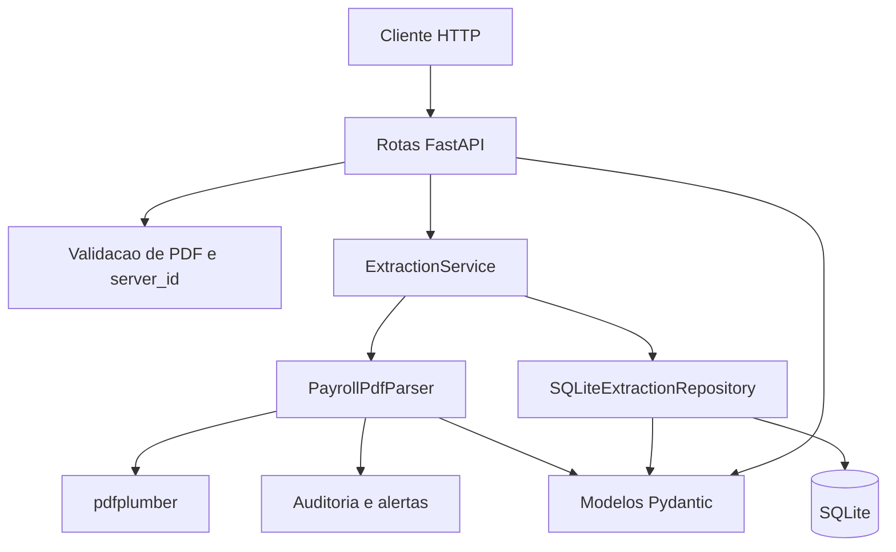
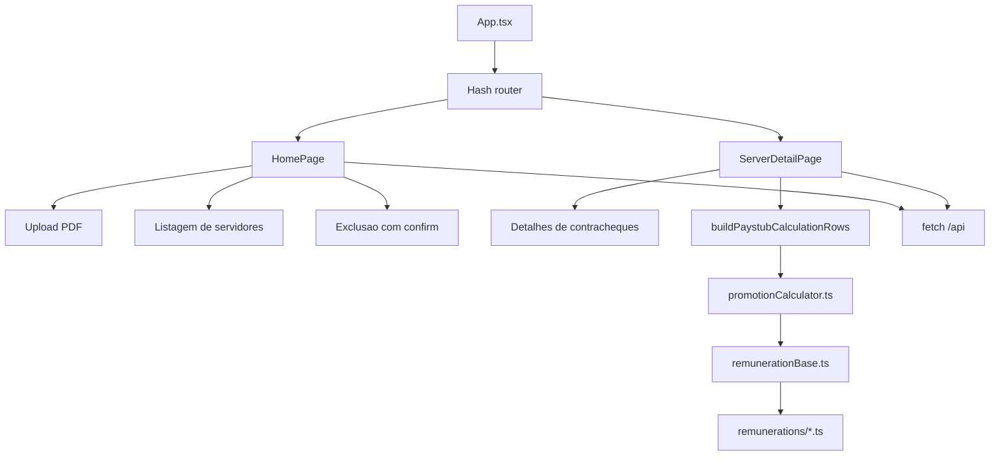
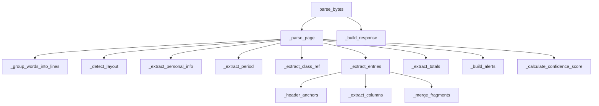

# C4 Componentes - calculadora-Juridica

## Backend FastAPI

```mermaid
flowchart TD
  Client[Cliente HTTP] --> Routes[Rotas FastAPI]
  Routes --> Validation[Validacao de PDF e server_id]
  Routes --> Service[ExtractionService]
  Service --> Parser[PayrollPdfParser]
  Service --> Repository[SQLiteExtractionRepository]
  Parser --> PDFPlumber[pdfplumber]
  Parser --> Audit[Auditoria e alertas]
  Parser --> DTOs[Modelos Pydantic]
  Repository --> SQLite[(SQLite)]
  Repository --> DTOs
  Routes --> DTOs
```

## Frontend React

```mermaid
flowchart TD
  App[App.tsx] --> Router[Hash router]
  Router --> Home[HomePage]
  Router --> Detail[ServerDetailPage]
  Home --> Upload[Upload PDF]
  Home --> StoredList[Listagem de servidores]
  Home --> Delete[Exclusao com confirm]
  Detail --> Paystubs[Detalhes de contracheques]
  Detail --> CalcRows[buildPaystubCalculationRows]
  CalcRows --> Promotion[promotionCalculator.ts]
  Promotion --> RemBase[remunerationBase.ts]
  RemBase --> Laws[remunerations/*.ts]
  Home --> APIClient[fetch /api]
  Detail --> APIClient
```

## Parser de PDF

```mermaid
flowchart TD
  ParseBytes[parse_bytes] --> ParsePage[_parse_page]
  ParsePage --> Lines[_group_words_into_lines]
  ParsePage --> Layout[_detect_layout]
  ParsePage --> Personal[_extract_personal_info]
  ParsePage --> Period[_extract_period]
  ParsePage --> ClassRef[_extract_class_ref]
  ParsePage --> Entries[_extract_entries]
  Entries --> Anchors[_header_anchors]
  Entries --> Columns[_extract_columns]
  Entries --> Merge[_merge_fragments]
  ParsePage --> Totals[_extract_totals]
  ParsePage --> Alerts[_build_alerts]
  ParsePage --> Score[_calculate_confidence_score]
  ParseBytes --> Response[_build_response]
```
