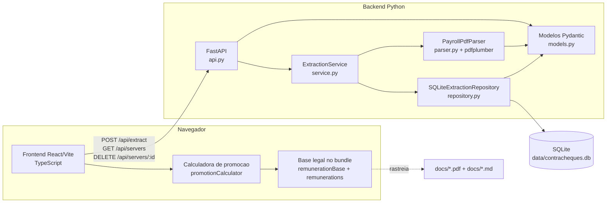

# C4 Containers - calculadora-Juridica

## Containers e tecnologias

| Container | Tecnologia | Responsabilidade |
|---|---|---|
| Frontend React/Vite | React 19, TypeScript, Vite | UI, rotas hash, upload, consulta, calculo e impressao |
| Base legal no bundle | TypeScript estatico | Catalogo legal, timeline e registros remuneratorios |
| Calculadora de promocao | TypeScript | Regras de progressao, janela retroativa e calculo monetario |
| Backend FastAPI | Python, FastAPI | API REST e coordenacao da extracao |
| Parser | Python, pdfplumber | Extracao posicional de PDFs |
| Repository | Python sqlite3 | Persistencia de snapshots |
| SQLite | SQLite | Banco local |
| Docs legais | PDF/Markdown | Evidencias e fontes juridicas |
