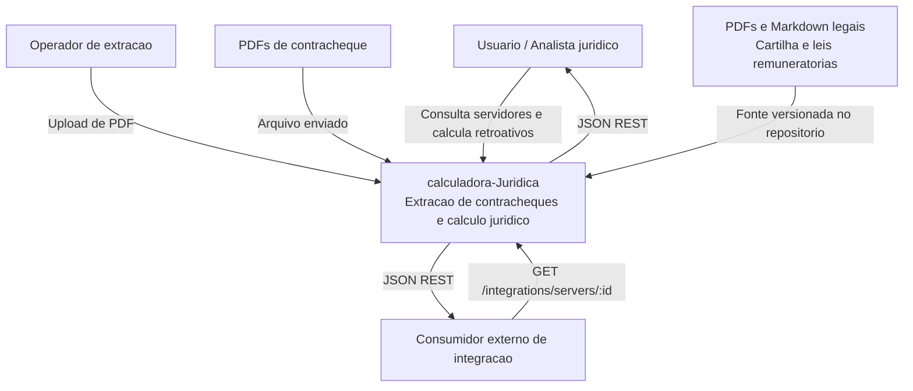

# C4 Contexto - calculadora-Juridica

## Relacionamentos

- 🟢 Usuario/analista usa a UI React para consultar contracheques e calcular diferencas.
- 🟢 Operador envia PDFs pelo frontend ou CLI.
- 🟢 Consumidor externo pode usar endpoint de integracao, se conseguir acessar o backend.
- 🟢 Documentos legais sao fontes estaticas no repositorio.
- 🟢 Nao ha API externa consumida em runtime.
