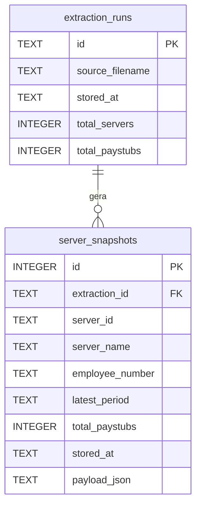
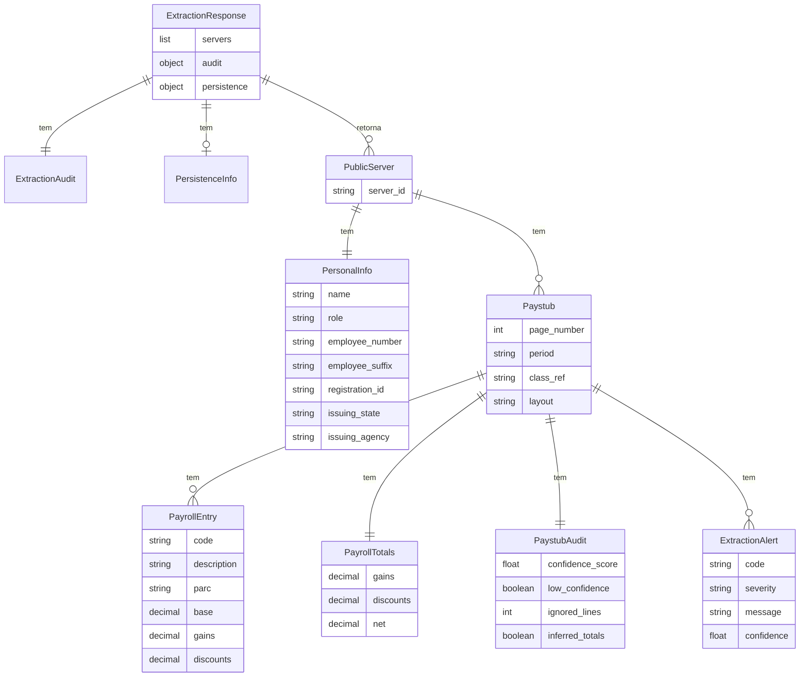
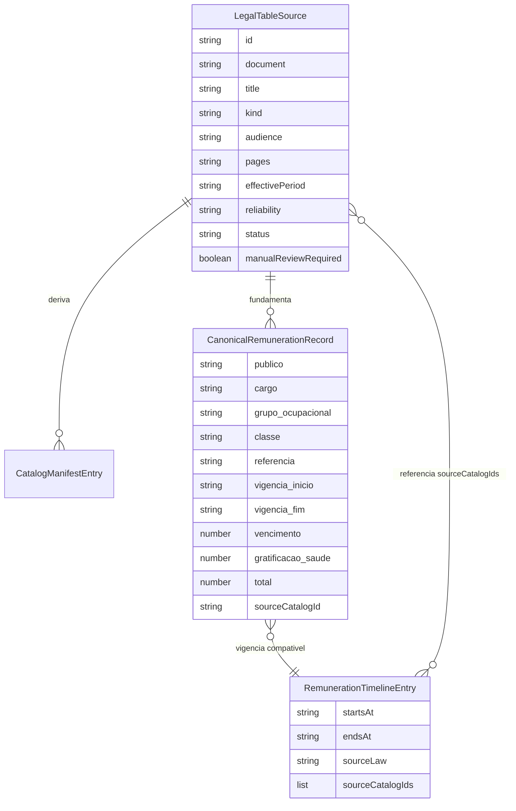

# ERD Completo - calculadora-Juridica

## Banco SQLite

## Modelo Logico do Payload JSON

## Modelo Logico da Base Legal

## Observacoes

- 🟢 `server_snapshots.payload_json` denormaliza o grafo `PublicServer`.
- 🟢 Nao ha tabelas SQL para rubricas, contracheques ou registros legais.
- 🟡 O modelo legal e logico/TypeScript, nao relacional.
