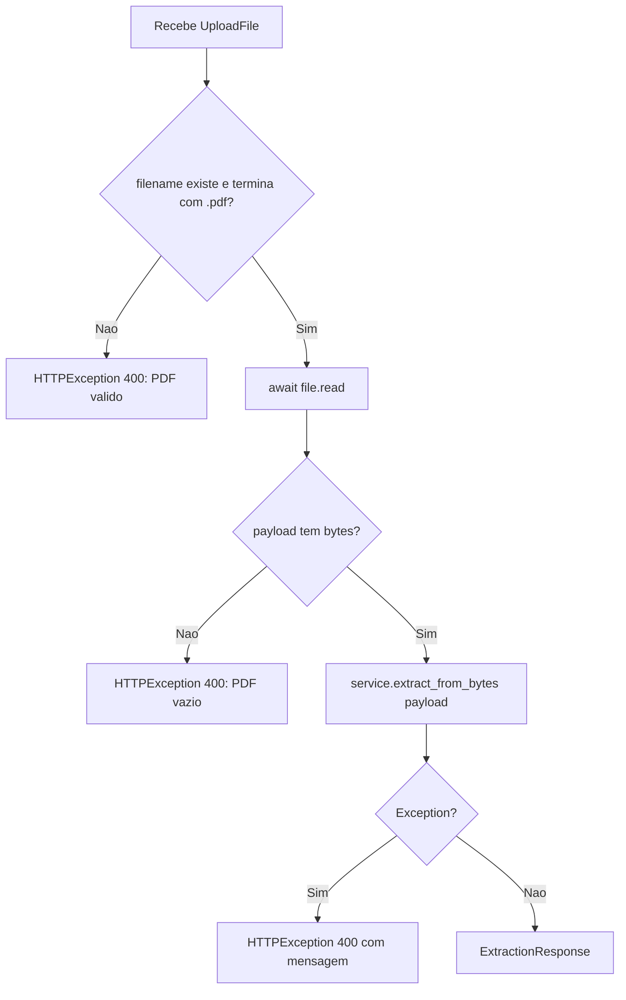

# Fluxograma - backend-api extract

```mermaid
flowchart TD
  A[Recebe UploadFile] --> B{filename existe e termina com .pdf?}
  B -->|Nao| C[HTTPException 400: PDF valido]
  B -->|Sim| D[await file.read]
  D --> E{payload tem bytes?}
  E -->|Nao| F[HTTPException 400: PDF vazio]
  E -->|Sim| G[service.extract_from_bytes payload]
  G --> H{Exception?}
  H -->|Sim| I[HTTPException 400 com mensagem]
  H -->|Nao| J[ExtractionResponse]
```
