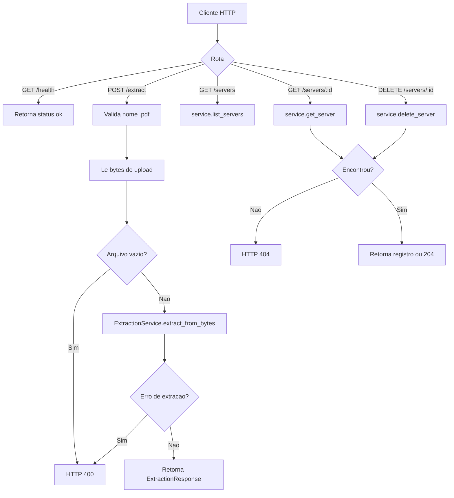

# Fluxograma - backend-api

```mermaid
flowchart TD
  A[Cliente HTTP] --> B{Rota}
  B -->|GET /health| C[Retorna status ok]
  B -->|POST /extract| D[Valida nome .pdf]
  D --> E[Le bytes do upload]
  E --> F{Arquivo vazio?}
  F -->|Sim| G[HTTP 400]
  F -->|Nao| H[ExtractionService.extract_from_bytes]
  H --> I{Erro de extracao?}
  I -->|Sim| G
  I -->|Nao| J[Retorna ExtractionResponse]
  B -->|GET /servers| K[service.list_servers]
  B -->|GET /servers/:id| L[service.get_server]
  B -->|DELETE /servers/:id| M[service.delete_server]
  L --> N{Encontrou?}
  M --> N
  N -->|Nao| O[HTTP 404]
  N -->|Sim| P[Retorna registro ou 204]
```
