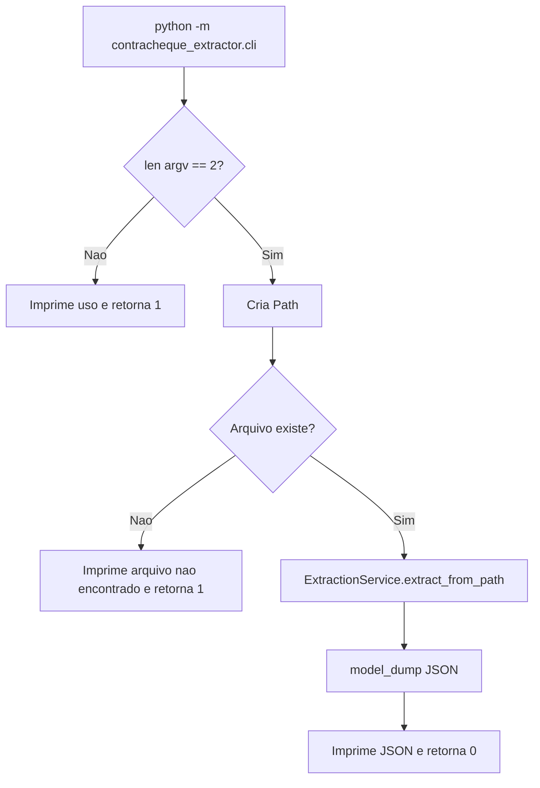

# Fluxograma - cli

```mermaid
flowchart TD
  A[python -m contracheque_extractor.cli] --> B{len argv == 2?}
  B -->|Nao| C[Imprime uso e retorna 1]
  B -->|Sim| D[Cria Path]
  D --> E{Arquivo existe?}
  E -->|Nao| F[Imprime arquivo nao encontrado e retorna 1]
  E -->|Sim| G[ExtractionService.extract_from_path]
  G --> H[model_dump JSON]
  H --> I[Imprime JSON e retorna 0]
```
