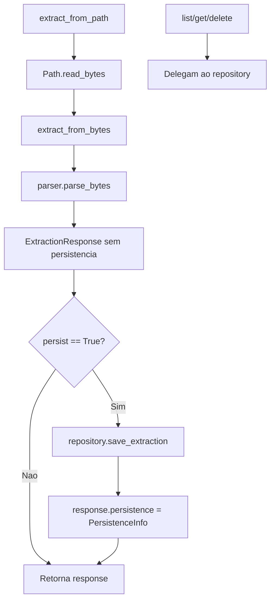

# Fluxograma - extraction-service

```mermaid
flowchart TD
  A[extract_from_bytes] --> B[parser.parse_bytes]
  B --> C[ExtractionResponse sem persistencia]
  C --> D{persist == True?}
  D -->|Nao| E[Retorna response]
  D -->|Sim| F[repository.save_extraction]
  F --> G[response.persistence = PersistenceInfo]
  G --> E
  H[extract_from_path] --> I[Path.read_bytes]
  I --> A
  J[list/get/delete] --> K[Delegam ao repository]
```
