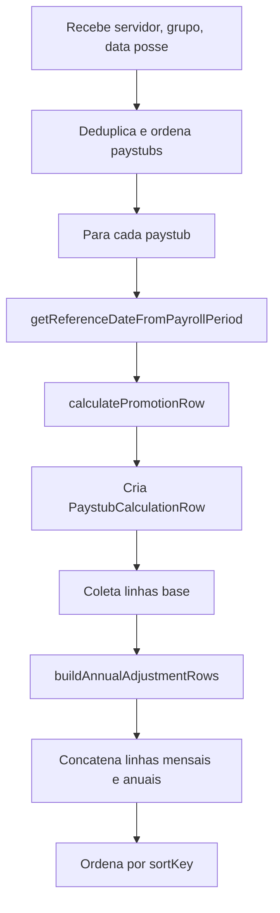

# Fluxograma - frontend-app buildPaystubCalculationRows

```mermaid
flowchart TD
  A[Recebe servidor, grupo, data posse] --> B[Deduplica e ordena paystubs]
  B --> C[Para cada paystub]
  C --> D[getReferenceDateFromPayrollPeriod]
  D --> E[calculatePromotionRow]
  E --> F[Cria PaystubCalculationRow]
  F --> G[Coleta linhas base]
  G --> H[buildAnnualAdjustmentRows]
  H --> I[Concatena linhas mensais e anuais]
  I --> J[Ordena por sortKey]
```
