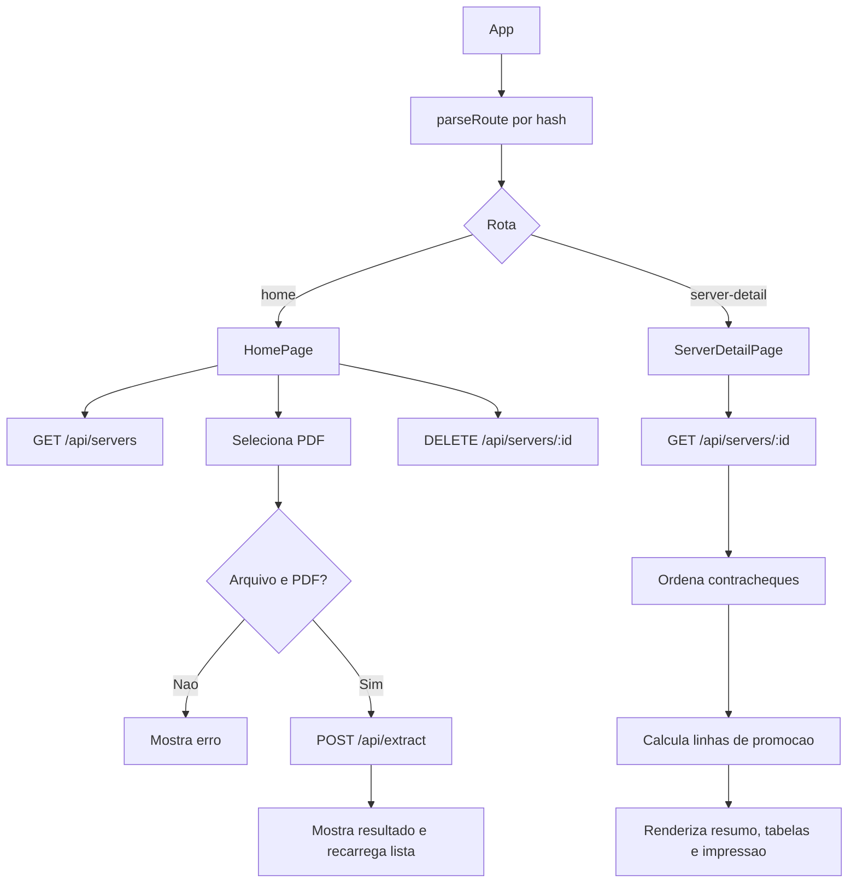

# Fluxograma - frontend-app

```mermaid
flowchart TD
  A[App] --> B[parseRoute por hash]
  B --> C{Rota}
  C -->|home| D[HomePage]
  C -->|server-detail| E[ServerDetailPage]
  D --> F[GET /api/servers]
  D --> G[Seleciona PDF]
  G --> H{Arquivo e PDF?}
  H -->|Nao| I[Mostra erro]
  H -->|Sim| J[POST /api/extract]
  J --> K[Mostra resultado e recarrega lista]
  D --> L[DELETE /api/servers/:id]
  E --> M[GET /api/servers/:id]
  M --> N[Ordena contracheques]
  N --> O[Calcula linhas de promocao]
  O --> P[Renderiza resumo, tabelas e impressao]
```
