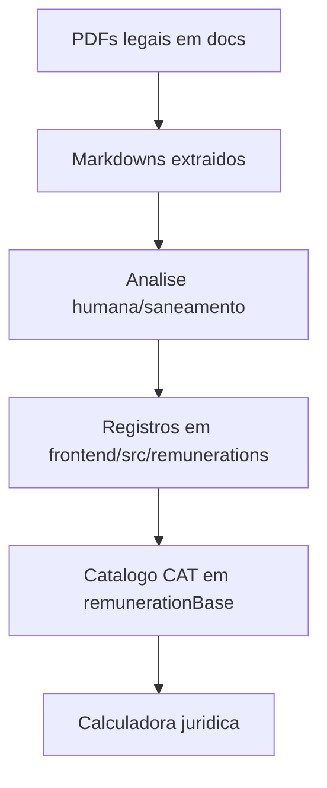

# Fluxograma - legal-docs

```mermaid
flowchart TD
  A[PDFs legais em docs] --> B[Markdowns extraidos]
  B --> C[Analise humana/saneamento]
  C --> D[Registros em frontend/src/remunerations]
  D --> E[Catalogo CAT em remunerationBase]
  E --> F[Calculadora juridica]
```
