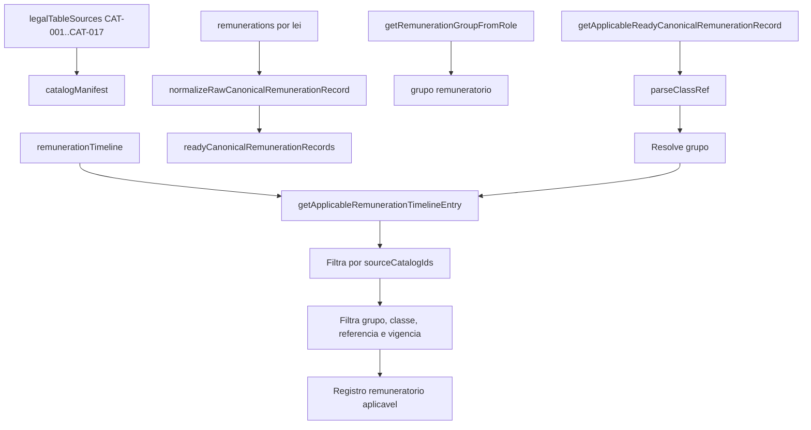

# Fluxograma - legal-remuneration-base

```mermaid
flowchart TD
  A[legalTableSources CAT-001..CAT-017] --> B[catalogManifest]
  C[remunerationTimeline] --> D[getApplicableRemunerationTimelineEntry]
  E[remunerations por lei] --> F[normalizeRawCanonicalRemunerationRecord]
  F --> G[readyCanonicalRemunerationRecords]
  H[getRemunerationGroupFromRole] --> I[grupo remuneratorio]
  J[getApplicableReadyCanonicalRemunerationRecord] --> K[parseClassRef]
  K --> L[Resolve grupo]
  L --> D
  D --> M[Filtra por sourceCatalogIds]
  M --> N[Filtra grupo, classe, referencia e vigencia]
  N --> O[Registro remuneratorio aplicavel]
```
