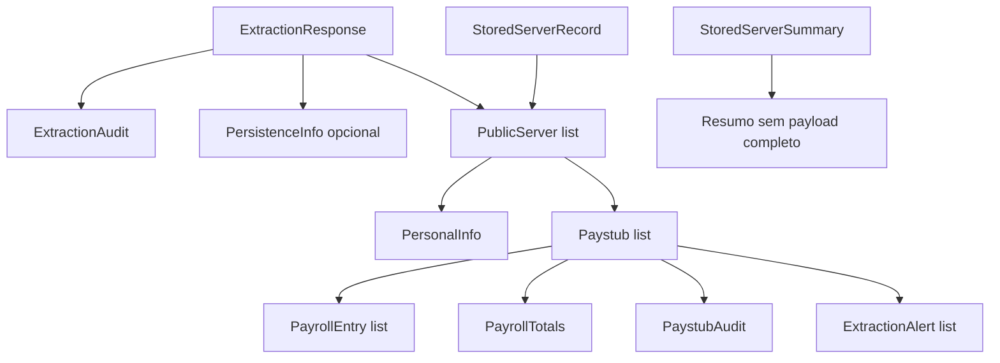

# Fluxograma - models

```mermaid
flowchart TD
  A[ExtractionResponse] --> B[ExtractionAudit]
  A --> C[PersistenceInfo opcional]
  A --> D[PublicServer list]
  D --> E[PersonalInfo]
  D --> F[Paystub list]
  F --> G[PayrollEntry list]
  F --> H[PayrollTotals]
  F --> I[PaystubAudit]
  F --> J[ExtractionAlert list]
  K[StoredServerRecord] --> D
  L[StoredServerSummary] --> M[Resumo sem payload completo]
```
