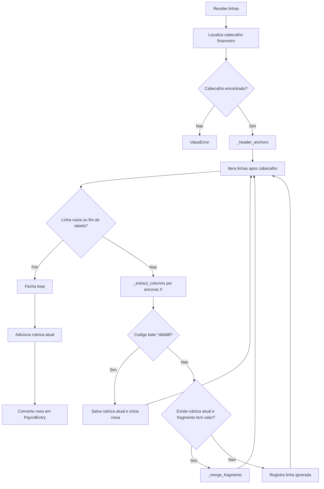

# Fluxograma - pdf-parser _extract_entries

```mermaid
flowchart TD
  A[Recebe linhas] --> B[Localiza cabecalho financeiro]
  B --> C{Cabecalho encontrado?}
  C -->|Nao| D[ValueError]
  C -->|Sim| E[_header_anchors]
  E --> F[Itera linhas apos cabecalho]
  F --> G{Linha vazia ou fim de tabela?}
  G -->|Fim| H[Fecha loop]
  G -->|Nao| I[_extract_columns por ancoras X]
  I --> J{Codigo bate ^dddd$?}
  J -->|Sim| K[Salva rubrica atual e inicia nova]
  J -->|Nao| L{Existe rubrica atual e fragmento tem valor?}
  L -->|Sim| M[_merge_fragments]
  L -->|Nao| N[Registra linha ignorada]
  K --> F
  M --> F
  N --> F
  H --> O[Adiciona rubrica atual]
  O --> P[Converte rows em PayrollEntry]
```
