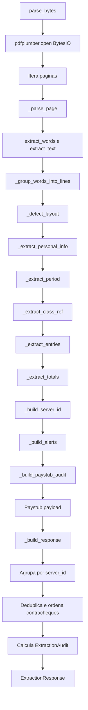

# Fluxograma - pdf-parser

```mermaid
flowchart TD
  A[parse_bytes] --> B[pdfplumber.open BytesIO]
  B --> C[Itera paginas]
  C --> D[_parse_page]
  D --> E[extract_words e extract_text]
  E --> F[_group_words_into_lines]
  F --> G[_detect_layout]
  G --> H[_extract_personal_info]
  H --> I[_extract_period]
  I --> J[_extract_class_ref]
  J --> K[_extract_entries]
  K --> L[_extract_totals]
  L --> M[_build_server_id]
  M --> N[_build_alerts]
  N --> O[_build_paystub_audit]
  O --> P[Paystub payload]
  P --> Q[_build_response]
  Q --> R[Agrupa por server_id]
  R --> S[Deduplica e ordena contracheques]
  S --> T[Calcula ExtractionAudit]
  T --> U[ExtractionResponse]
```
