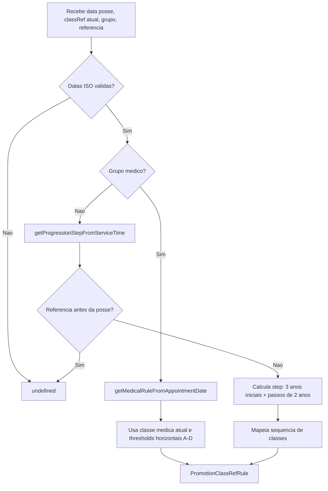

# Fluxograma - promotion-calculator getPromotionRuleFromAppointmentDate

```mermaid
flowchart TD
  A[Recebe data posse, classRef atual, grupo, referencia] --> B{Datas ISO validas?}
  B -->|Nao| C[undefined]
  B -->|Sim| D{Grupo medico?}
  D -->|Sim| E[getMedicalRuleFromAppointmentDate]
  E --> F[Usa classe medica atual e thresholds horizontais A-D]
  F --> G[PromotionClassRefRule]
  D -->|Nao| H[getProgressionStepFromServiceTime]
  H --> I{Referencia antes da posse?}
  I -->|Sim| C
  I -->|Nao| J[Calcula step: 3 anos iniciais + passos de 2 anos]
  J --> K[Mapeia sequencia de classes]
  K --> G
```
