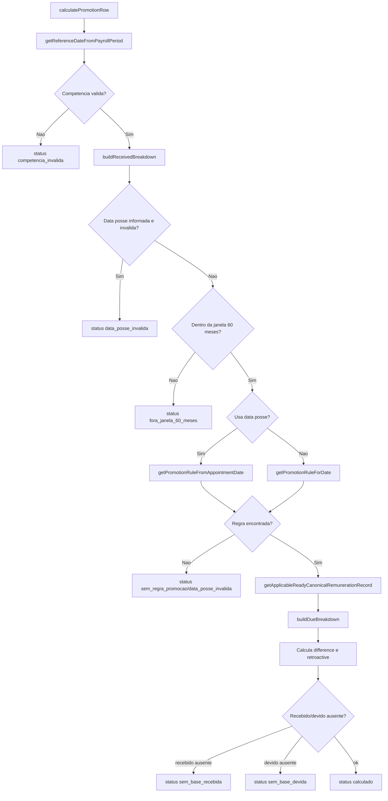

# Fluxograma - promotion-calculator

```mermaid
flowchart TD
  A[calculatePromotionRow] --> B[getReferenceDateFromPayrollPeriod]
  B --> C{Competencia valida?}
  C -->|Nao| D[status competencia_invalida]
  C -->|Sim| E[buildReceivedBreakdown]
  E --> F{Data posse informada e invalida?}
  F -->|Sim| G[status data_posse_invalida]
  F -->|Nao| H{Dentro da janela 60 meses?}
  H -->|Nao| I[status fora_janela_60_meses]
  H -->|Sim| J{Usa data posse?}
  J -->|Sim| K[getPromotionRuleFromAppointmentDate]
  J -->|Nao| L[getPromotionRuleForDate]
  K --> M{Regra encontrada?}
  L --> M
  M -->|Nao| N[status sem_regra_promocao/data_posse_invalida]
  M -->|Sim| O[getApplicableReadyCanonicalRemunerationRecord]
  O --> P[buildDueBreakdown]
  P --> Q[Calcula difference e retroactive]
  Q --> R{Recebido/devido ausente?}
  R -->|recebido ausente| S[status sem_base_recebida]
  R -->|devido ausente| T[status sem_base_devida]
  R -->|ok| U[status calculado]
```
