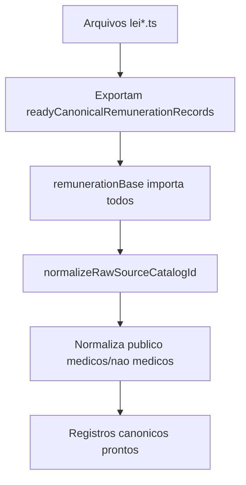

# Fluxograma - remuneration-laws

```mermaid
flowchart TD
  A[Arquivos lei*.ts] --> B[Exportam readyCanonicalRemunerationRecords]
  B --> C[remunerationBase importa todos]
  C --> D[normalizeRawSourceCatalogId]
  D --> E[Normaliza publico medicos/nao medicos]
  E --> F[Registros canonicos prontos]
```
