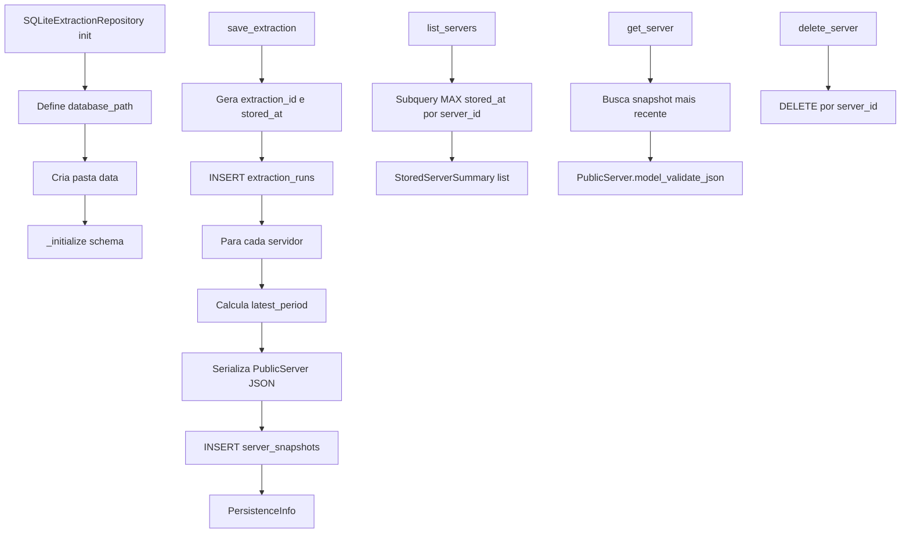

# Fluxograma - sqlite-repository

```mermaid
flowchart TD
  A[SQLiteExtractionRepository init] --> B[Define database_path]
  B --> C[Cria pasta data]
  C --> D[_initialize schema]
  E[save_extraction] --> F[Gera extraction_id e stored_at]
  F --> G[INSERT extraction_runs]
  G --> H[Para cada servidor]
  H --> I[Calcula latest_period]
  I --> J[Serializa PublicServer JSON]
  J --> K[INSERT server_snapshots]
  K --> L[PersistenceInfo]
  M[list_servers] --> N[Subquery MAX stored_at por server_id]
  N --> O[StoredServerSummary list]
  P[get_server] --> Q[Busca snapshot mais recente]
  Q --> R[PublicServer.model_validate_json]
  S[delete_server] --> T[DELETE por server_id]
```
