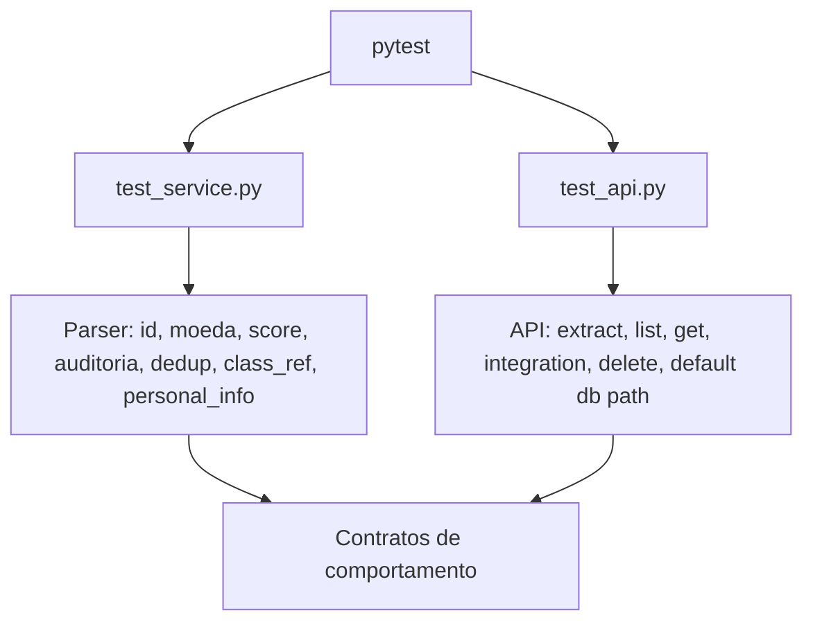

# Fluxograma - tests

```mermaid
flowchart TD
  A[pytest] --> B[test_service.py]
  A --> C[test_api.py]
  B --> D[Parser: id, moeda, score, auditoria, dedup, class_ref, personal_info]
  C --> E[API: extract, list, get, integration, delete, default db path]
  D --> F[Contratos de comportamento]
  E --> F
```
