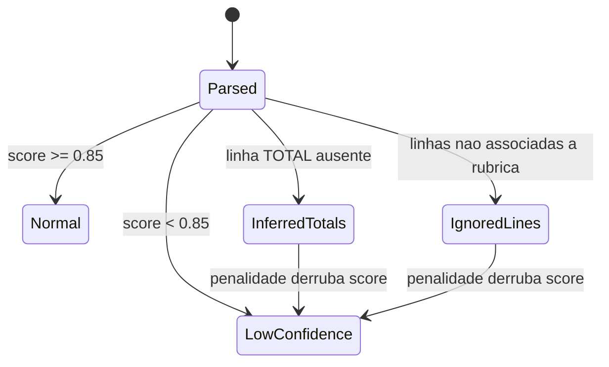
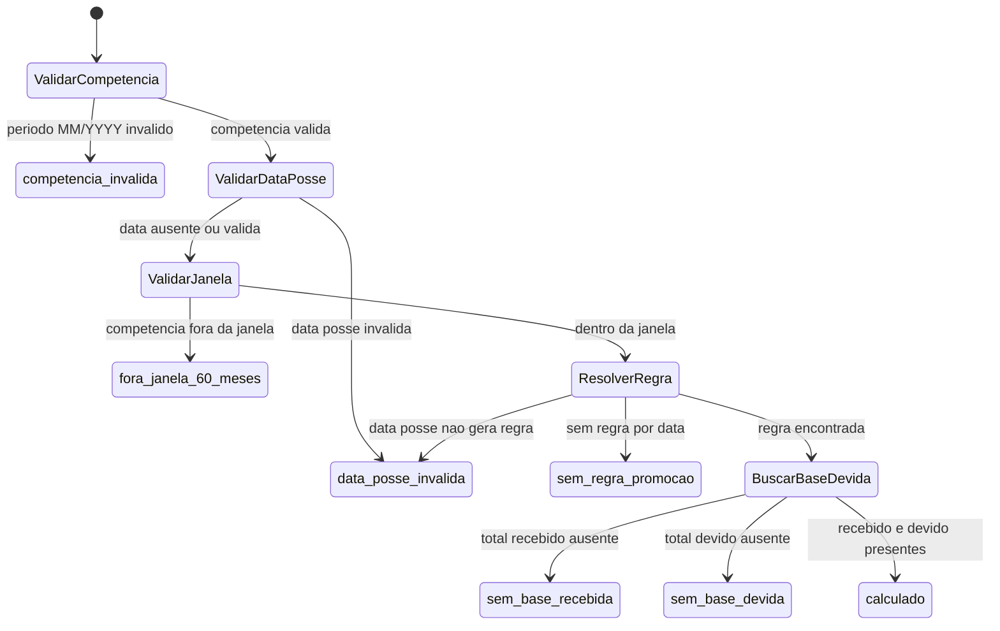
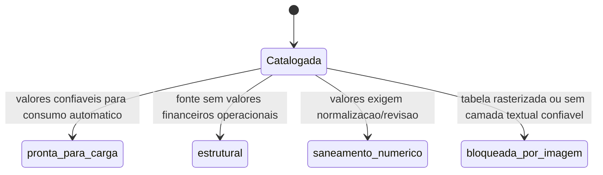
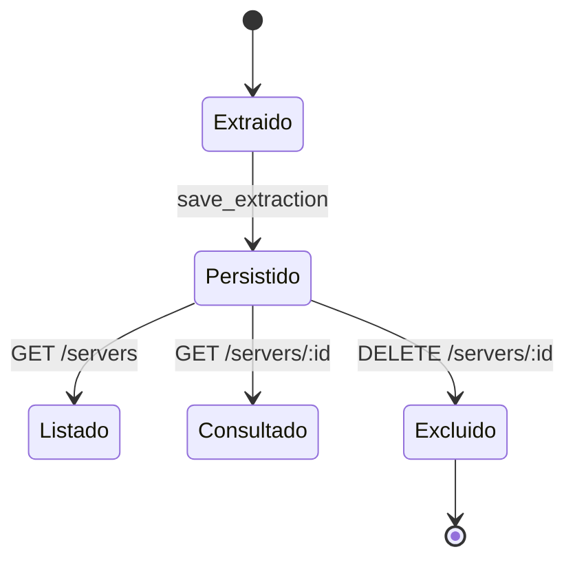

# Maquinas de Estado - calculadora-Juridica

Gerado pelo Reversa Detective em 2026-05-14T22:28:00Z.

## Visao Geral

O sistema nao possui entidade persistida com campo unico de status e transicoes formais. Existem, porem, estados operacionais confirmados em auditoria de extracao, status de calculo de promocao e status de saneamento das fontes legais.

## PaystubAudit

Estados derivados:

- `normal`: `low_confidence = false`, sem alerta de baixa confianca.
- `low_confidence`: score abaixo do limite e alerta `low_confidence_page`.
- `inferred_totals`: totais inferidos por ausencia de linha explicita.
- `ignored_lines`: pagina teve linhas de tabela ignoradas.

Confiança: 🟢 CONFIRMADO.

## PromotionCalculationStatus

Valores confirmados em `PromotionCalculationStatus`:

- `calculado`
- `sem_regra_promocao`
- `sem_base_recebida`
- `sem_base_devida`
- `competencia_invalida`
- `data_posse_invalida`
- `fora_janela_60_meses`

Confiança: 🟢 CONFIRMADO.

## LegalTableStatus

Valores confirmados:

- `pronta_para_carga`
- `estrutural`
- `saneamento_numerico`
- `bloqueada_por_imagem`

Confiança: 🟢 CONFIRMADO para valores; 🟡 INFERIDO para transicoes, pois o codigo declara os estados mas nao implementa workflow de saneamento.

## Snapshot de Servidor

O snapshot nao tem status textual, mas tem ciclo operacional:

Confiança: 🟢 CONFIRMADO para eventos; 🟡 INFERIDO para modelagem como maquina de estado.
